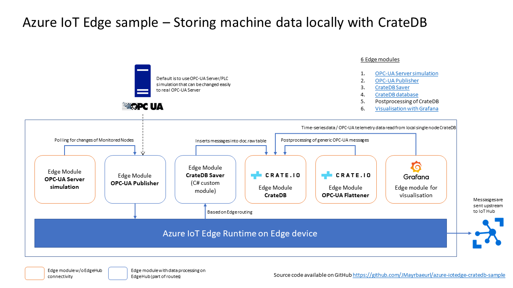

# Azure IoT Edge CrateDB sample

This is an [Azure IoT Edge](https://azure.microsoft.com/en-us/services/iot-edge/) sample showing how to store machine data from OPC-UA servers locally in a single node [CrateDB](https://crate.io/) database. All necessary components will be deployed by Azure IoT Edge.

# Configuration

To be able to run this sample on your edge device, you'll need to have [Azure IoT Edge](https://github.com/Azure/iotedgehubdev#installing) installed on the device, including a container runtime like Docker. The sample was developed on a Windows 10 IoT machine with Docker Desktop and Linux container and tested on macOS. 

Since this sample was developed with Visual Studio Code, the easiest way to run the sample is by using Visual Studio Code with the according Azure IoT Edge Plugin, as used for [custom module development of Azure IoT Edge](https://docs.microsoft.com/en-us/azure/iot-edge/tutorial-csharp-module).

# Set up the Edge Device as a Vagrant VM

This approach makes the set-up experience more streamlined.

1. Checkout this repo `git clone https://github.com/crate/azure-iotedge-cratedb-sample.git`
2. Install [Vagrant](https://www.vagrantup.com/downloads.html).
3. Install [Visual Studio Code](https://code.visualstudio.com/download).
4. Install extensions for Visual Studio Code: (On the Visual Studio Code: Menu -> Preferences -> Extensions)
    1. Azure IoT Hub Toolkit
    2. Azure IoT Edge
    3. Vagrant
5. You need to install [Docker](https://www.docker.com/get-started).
6. Open the project folder (the one you checked out from the repository) in Visual Studio Code.
7. Create a folder `crate` in the project directory. For me, it is `/gn/git/azure-iotedge-cratedb-sample/crate`.
8. Follow the instructions under 'Configuring the local database'.
9. Create an IoT Hub (S1) on Azure. You'll need to wait for it to be in an active state, it could take a while.
10. After your IoT hub has started, you can use Visual Studio Code integration to connect to it.
11. In Visual Studio Code (or on the Azure Portal), you can create a new IoT Edge Device.
12. Right click on the device and select “Copy Device Connection String” from the Menu.
13. Go to the Vagrant folder of the project, for me it is `cd /gn/git/azure-iotedge-cratedb-sample/vagrant`.
14. Modify the `config.template.yaml` to use your Device Connection String and rename it to `config.yaml`.
15. Copy the contents of `.env.template` into a new file `.env`. The default settings work out of the box for the vagrant box.
16. Right click on `deployment.template.json` and click on 'Build IoT Edge Solution'.
17. Go to the config folder, right click on `deployment.amd64.json` and click on 'Create Deployment for Single Device'.
18. In your terminal, start Vagrant by `vagrant up`.
19. Open the shh by running `vagrant ssh`.
20. Restart the service inside the VM by `sudo systemctl restart iotedge`.

## Configuring the local database

Before starting to deploy the sample to the edge device, the local CrateDB used in the sample has to be created first. An existing CrateDB in the local network could be used, too, but this sample uses CrateDB running in a container on the same device as the Azure IoT Edge runtime. 
This setup step should be done in your laptop, and will create the information in a data folder. This data folder is then shared with the Edge module, so the tables will be there. (that's why we start and stop the container after running the SQL)

1. Create a folder on the disk for the CrateDB database files under the `crate` folder that you created above in step 7. For me, it is `/gn/git/azure-iotedge-cratedb-sample/crate/data`.
2. Run CrateDB locally from the command line by using `docker run -p "4200:4200" -d --rm --name cratedb -v /gn/git/azure-iotedge-cratedb-sample/crate/data:/data crate:4.1.2` and replace it with the location for the folder you have created in step 1.
3. Open a web browser with `http://localhost:4200` and go to the CrateDB Admin UI console.
4. Create the tables and the user by executing all SQL Statements in the file `./scripts/database_setup/createTable.sql`.
5. Stop the container with `docker container stop cratedb`.

## Configuring the OPC-UA Publisher edge module

1. Per default this sample uses all nodes from the [OPC-UA Server simulation](https://github.com/Azure-Samples/iot-edge-opc-plc). If you want to change the setup, just edit the `publishednodes.json` file in the folder `appdata`
2. Edit the files `deployment.template.json` and `deployment.debug.template.json` by changing the publisher's data folder from `C:/Dev/iotedge/crate/localstorageCrateDBEdgeSolution` to the directory you've downloaded the source repository on your local disk.

## Connecting to CrateDB
The Vagrantfile binds the CrateDB on the edge device port 4200 to the port 4200 in your system. Browse to `http://localhost:4200` and you will find the CrateDB Admin UI.

## Connecting to Grafana
The Vagrantfile binds the grafana on the edge device port 3000 to the port 3000 in your system. Browse to `http://localhost:3000` and you will find the login page. Use `admin` as username and password.
